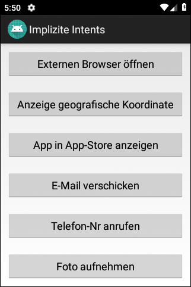
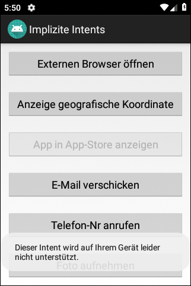

# Android-App "Implizite Intents"

Android app shows how to invoke external apps using <i>implicit intents</i>.

 

Identifiers (names for classes, variables and methods), UI texts and Comments (JavaDoc) are in German only.

 

----
## Screenshots

<!--    -->

 

----
# License

See the [LICENSE file](LICENSE.md) for license rights and limitations (BSD 3-Clause License).
