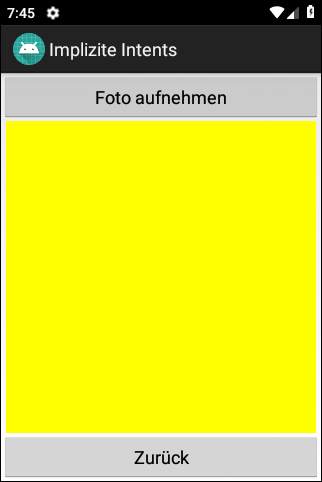

# Android-App "Implizite Intents" #

 

Android app shows how to invoke external apps using <i>implicit intents</i>.

 

**Related projects:**
* [Explicit Intents](https://github.com/MDecker-MobileComputing/Android_ZweiActivities)
* [Custom Implicit Intent](https://github.com/MDecker-MobileComputing/Android_ImpliziteIntents)

 

Identifiers (names for classes, variables and methods), UI texts and Comments (JavaDoc) are in German only.

 

----

## Screenshots ##

 

  

 

----

## License ##

 

See the [LICENSE file](LICENSE.md) for license rights and limitations (BSD 3-Clause License).

 